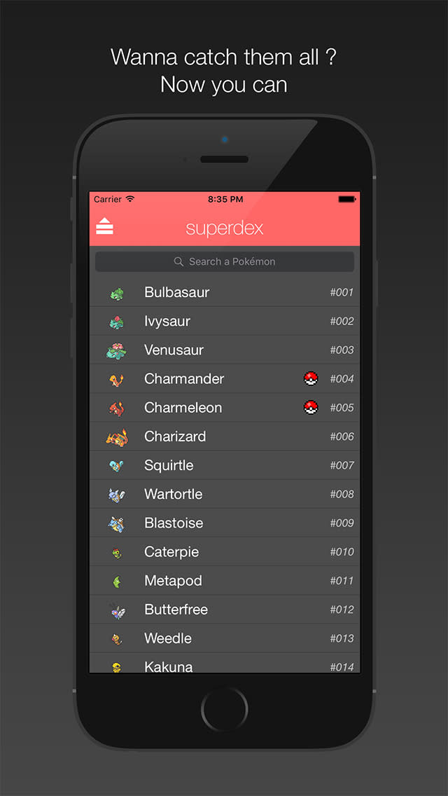

# superdex

## An open source "pokedex" coded in Swift 3

It basically fetch datas from [pokeapi.co](https://www.pokeapi.co), organize and display them into a nice-cozy interface

## Features

- 3D Gif animations !
- Sounds effects !
- More than 800 pokemon !
- You can search a pokemon and show its details (moves, next evolution etc.)
- You can play a pokemon cries
- You can mark and save (into `UserDefaults`) a pokemon as "catched", then there's an 8 bits pokeball icon shown on the main screen on the line of the "catched" pokemon
- You have access to some statistics (ex: the ratio of `existing pokemon / pokemon catched`)

## Some screenshots

